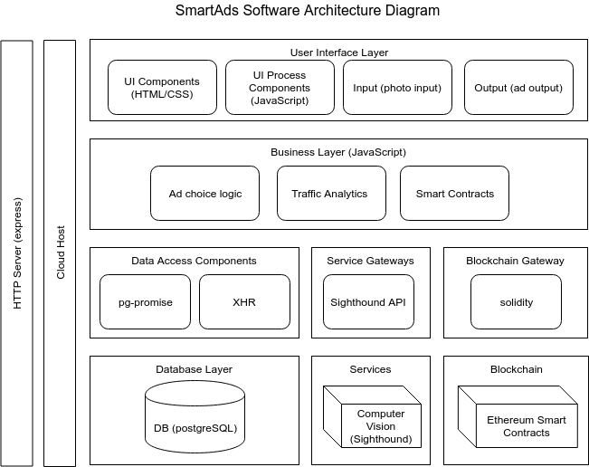

# Smart Ads

**The integration of computer vision technology and digital billboards provide opportunity to target ads to consumers more effectively.**

## Problem Statement

- Digital billboards are becoming ubiquitous.
- Cars (make, model, year) provide valuable demographic information to advertisers.
- Using this information, advertisers can target ads according to the predicted demographic of the drivers of cars passing a billboard.

## Tecnologies Used
- HTML/CSS
- JavaScript
- Node.js
    - express
    - request-promise
    - pg-promise
- postgreSQL
- 3rd Party API: Sighthound

## Software Architecture

- User Interface Layer
    - UI Components
    - UI Process Components
    - Camera: replicated by a folder of photos
    - Billboard
- Business Layer
    - Ad choice
    - Analytics
        - Traffic
        - Ad presentation
- Persistence Layers
    - Data access components
- Database Layer: PostgreSQL
- Services: Sighthound
- Overaching components:
    - Cloud hosting: Digital Ocean
    - HTTP Server: express

## Resources Used
**Stitched files and processes together from a handful of sources. The one's that provided the largest amount of direct reference are below:**
- BadBank/Three-tier Server Methodology: https://github.com/randallchase/badbank
- Setting up the server with .bin/www/ for continuous server while developing: https://scotch.io/tutorials/getting-started-with-node-express-and-postgres-using-sequelize
- Setting up RESTful API with express and Postgres: 
    - https://mherman.org/blog/designing-a-restful-api-with-node-and-postgres/
    - https://github.com/mjhea0/node-postgres-promises